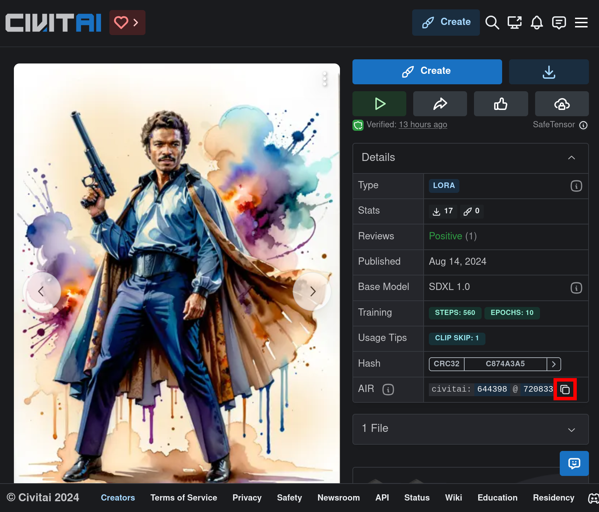

# Civitai Model Downloader
This simple command line application watches the clipboard for Civitai URNs. When one is detected the model is automatically downloaded.


# Installation

## Binary Releases
Download the latest [release](https://github.com/rfletchr/civitai_model_downloader/releases/latest)

## Go Install
``` bash
go install github.com/rfletchr/civitai_model_downloader@latest
```

# Setup
First [setup an API key](https://education.civitai.com/civitais-guide-to-downloading-via-api/#how-do-i-download-via-the-api
) and keep note of it.

Run the tool via a command prompt / terminal.
```bash
./civitai_model_downloader
```
The tool will exit and ask you to add an API key to a configuration file. Open the configuration file and paste in your API key.

```yaml
api_key: 452d91e3ea8cd6e7905709207ac2fff1
directory: /home/user/stable_diffusion/models
```

save the file and restart the tool
```bash
./civitai_model_downloader
```

You should see output similar to this
```
2024/08/14 15:49:54 INFO Loading...
2024/08/14 15:49:54 INFO Setting Up Config.
2024/08/14 15:49:54 INFO Loading Config.
2024/08/14 15:49:54 INFO Using Config File: /home/user/.config/civitai/model_downloader.yaml
2024/08/14 15:49:54 INFO Using Directory: /home/user/stable_diffusion/models
2024/08/14 15:49:54 INFO Waiting for models to download...
2024/08/14 15:49:54 INFO Starting Clipboard Watcher
```

Now that the tool is up and running you can simply copy a models AIR and it will be downloaded.

